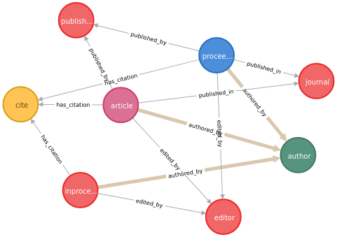

# Reading from dblp.uni-trier.de

From the xml's description in https://dblp.org/faq/16154937.html

> article – An article from a journal or magazine.
> inproceedings – A paper in a conference or workshop proceedings.
> proceedings – The proceedings volume of a conference or workshop.
> book – An authored monograph or an edited collection of articles.
> incollection – A part or chapter in a monograph.
> phdthesis – A PhD thesis.
> mastersthesis – A Master's thesis. There are only very few Master's theses in dblp.
> www – A web page. There are only very few web pages in dblp. See also the notes on person records.

We will be removing from the import, by removing it from the dtd file.

- book
- incollection
- phdthesis
- masterthesis
- www

This makes the resulting graph smaller

- node count from 9,985,270 to 7,338, 701
- relationship count from 19,917,751 to 17,079,387

```bash
#!/bin/bash
./XMLToCSV.py --annotate --neo4j dblp-raw/dblp.xml dblp-raw/dblp_slim.dtd output_slim/output.csv --relations author:authored_by journal:published_in publisher:published_by school:submitted_at editor:edited_by cite:has_citation
```

and the `neo4j-admin` command is

```bash
#!/bin/bash
neo4j-admin import --mode=csv --database=dblp_slim.db --delimiter ";" --array-delimiter "|" --id-type INTEGER --nodes:inproceedings "output_slim/output_inproceedings_header.csv,output_slim/output_inproceedings.csv" --nodes:article "output_slim/output_article_header.csv,output_slim/output_article.csv" --nodes:proceedings "output_slim/output_proceedings_header.csv,output_slim/output_proceedings.csv" --nodes:editor "output_slim/output_editor.csv" --relationships:edited_by "output_slim/output_editor_edited_by.csv" --nodes:publisher "output_slim/output_publisher.csv" --relationships:published_by "output_slim/output_publisher_published_by.csv" --nodes:journal "output_slim/output_journal.csv" --relationships:published_in "output_slim/output_journal_published_in.csv" --nodes:author "output_slim/output_author.csv" --relationships:authored_by "output_slim/output_author_authored_by.csv" --nodes:cite "output_slim/output_cite.csv" --relationships:has_citation "output_slim/output_cite_has_citation.csv"
```

We get something like this



We are then missing the following nodes

- topics
- keywords
- journals
- volumes

and the following relationships

- topic -> has -> keywords
- article -> cited_by -> article
- author -> reviews -> article

## Faking citations

citations are hard to parse from xml data, so we will be randomly linking articles between them using the `cited_in` relationship

creating a relationship

```cypher
MATCH (a:article),(b:article)
WHERE ID(a) = 12 AND ID(b) = 13
CREATE (a)-[r:cited_by]->(b)
RETURN type(r)
```

deleting a relationship

```cypher
MATCH p=(:article)-[r:cited_by]->(:article) delete r
```

query relationships

```
MATCH p=(:article)-[r:cited_by]->(:article) RETURN p LIMIT 25
```

## faking topics and keywords

It's not trivial to parse keywords and topics from data, so we will fake some topics and random keywords using the faker library.

##